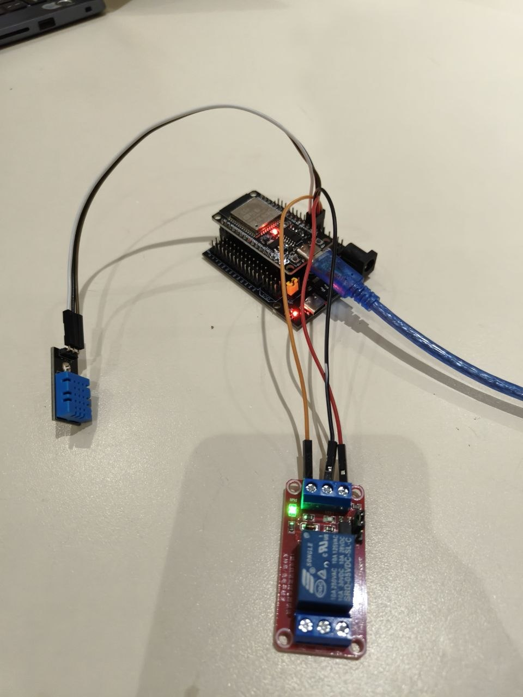
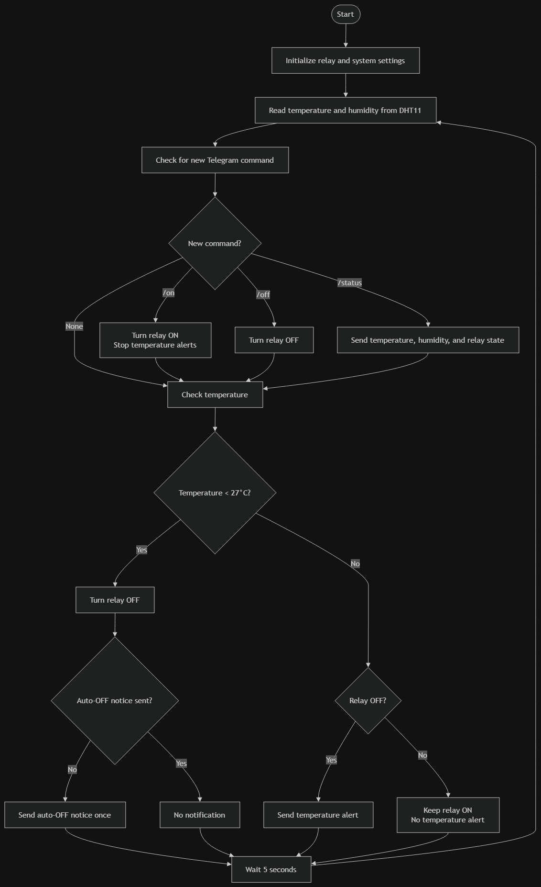
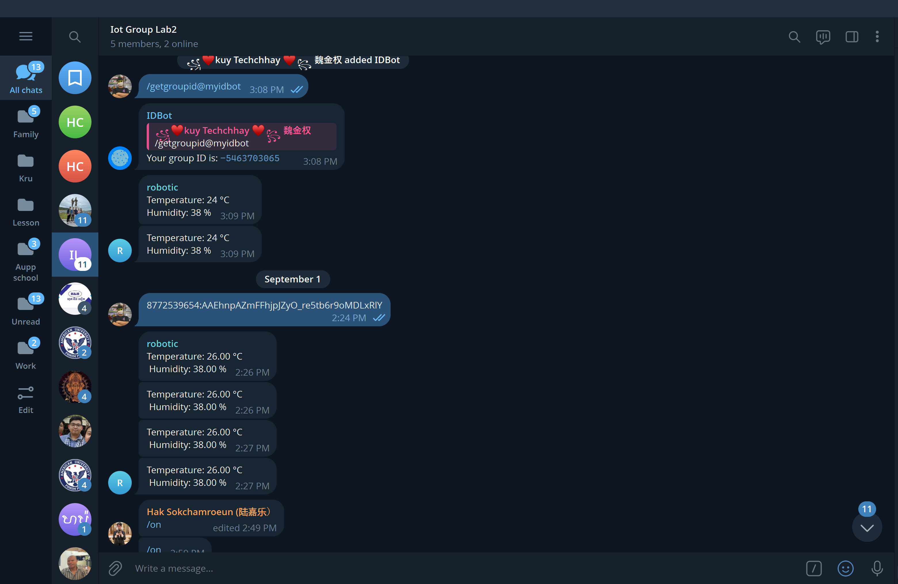

# IOT_LAB-2-assignment

# LAB1: Temperature Sensor with Relay Control Using Telegram

## 1. Overview

This project is an IoT temperature monitoring and relay control system using an ESP32, temperature/humidity sensor, relay module, Wi-Fi, and Telegram Bot API.

The ESP32 reads the temperature and humidity every 5 seconds.

The Telegram bot allows the user to:
- Use `/status` to check temperature, humidity, and relay state.
- Use `/on` to turn the relay ON.
- Use `/off` to turn the relay OFF.

When the temperature is 25°C or higher and the relay is OFF, the ESP32 sends a warning message every 5 seconds.

When the user sends `/on`, the relay turns ON and the warning messages stop.

When the temperature drops below 25°C, the relay automatically turns OFF and sends a one-time auto-OFF message.


## 2. Equipment

The equipment used in this lab:

- ESP32 Development Board
- DHT temperature and humidity sensor
- 1-channel relay module
- Jumper wires
- USB cable
- Laptop with Thonny
- Wi-Fi connection
- Telegram application


## 3. Wiring

The components are connected to the ESP32 as follows:

| Component | ESP32 Pin |
|-----------|-----------|
| DHT VCC | 3.3V |
| DHT GND | GND |
| DHT DATA | GPIO 4 |
| Relay VCC | 5V |
| Relay GND | GND |
| Relay IN | GPIO [YOUR RELAY GPIO] |

### Wiring Photo




## 4. Software Setup

The ESP32 uses MicroPython and the program was written using Thonny IDE.

The main libraries used are:

```python
from machine import Pin
import dht
import network
import time
import urequests
```

Configuration Steps

Before running the program, configure the Wi-Fi and Telegram settings in Source Code.py.

Step 1: Configure Wi-Fi

Enter your Wi-Fi network name and password in the source code:

SSID = "YOUR_WIFI_NAME"
PASSWORD = "YOUR_WIFI_PASSWORD"
Step 2: Create a Telegram Bot
Open Telegram and search for BotFather.
Send /newbot.
Follow the instructions to create a bot.
Copy the bot token provided by BotFather.
Enter the token in the source code:
BOT_TOKEN = "YOUR_BOT_TOKEN"
Step 3: Configure the Chat ID
Add the bot to your Telegram group.
Send a message in the group.
Obtain the group chat ID.
Enter the chat ID in the source code:
CHAT_ID = "YOUR_CHAT_ID"
Step 4: Configure the Temperature Limit

The program uses a temperature limit to control the relay and send alerts.

TEMP_LIMIT = 27

This value can be adjusted for testing.

Step 5: Upload and Run the Program
Connect the ESP32 to the laptop using a USB cable.
Open Source Code.py in Thonny IDE.
Select the ESP32 device and the correct serial port.
Enter the Wi-Fi and Telegram configuration.
Upload the Python file to the ESP32.
Run the program.
Open the Telegram group and send commands to the bot.

## 5. Usage Instructions

After the ESP32 connects to Wi-Fi, open the Telegram group and send commands to the bot.

Command	Function
/status	Displays the current temperature, humidity, and relay state.
/on	Turns the relay ON and stops temperature alerts.
/off	Turns the relay OFF.
Example Usage

Send:

/status

The bot replies with the current temperature, humidity, and relay state.

Send:

/on

The relay turns ON and temperature alerts stop.

Send:

/off

The relay turns OFF.

Automatic Temperature Control

The ESP32 reads the temperature and humidity every 5 seconds.

When the temperature reaches the configured limit and the relay is OFF, the bot sends a warning message every 5 seconds.

When /on is received, the relay turns ON and warning messages stop.

When the temperature drops below the configured limit, the relay automatically turns OFF and a one-time auto-OFF notification is sent.


## 6. Flowchart



## 7. Evidence

Task 1 — Sensor Read & Print
The ESP32 reads the temperature and humidity and prints the values to the serial monitor.
.JPG)
.jpg)
.jpg)

Task 2 — Telegram Send
The send_message() function is used to send a test message to the Telegram group.


Task 3 — Telegram Bot Commands
The bot responds to /status, /on, and /off.
.jpg)
.jpg)


Task 4 — Automatic Temperature Control
The demonstration video shows the temperature-based relay control, temperature alerts, and automatic relay OFF behavior.
